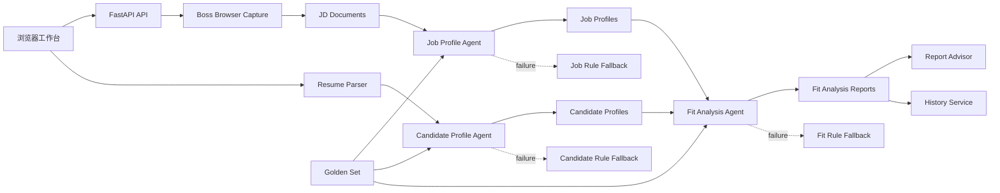

# JobLab 项目上下文与接力说明

> 用途：供下一次新会话快速恢复当前产品目标、工程状态和后续工作。
>
> 恢复时先阅读本文件，再执行 `git status --short`、`git log --oneline -10` 校准实时状态。不要根据版本截图直接假定改动已经提交。

## 1. 当前正在做什么

JobLab 已从早期的“通用对话 + 技能关键词统计”逐步收敛为一个求职适配分析产品：

1. 从 Boss 直聘采集或手动导入真实 JD。
2. 基于多条 JD 生成结构化岗位画像。
3. 上传或粘贴简历，生成结构化候选人画像。
4. 对岗位画像和候选人画像进行五维适配分析。
5. 输出优势、差距、学习计划、面试策略和证据引用。
6. 保存历史报告，并允许基于当前报告向“适配顾问”追问。

当前产品定位不是通用 AI 聊天工具，也不是自动投递工具，而是：

> 基于真实岗位要求和个人简历，生成岗位画像、候选人画像与可解释适配报告的求职决策工具。

## 2. 当前 Git 状态

- 当前分支：`product-mvp`
- 当前 HEAD：`b683c92 feat: LLM-first profile analysis with rule fallback v0.36`
- 相对远端：本地 `product-mvp` 比 `origin/product-mvp` 领先 3 个提交。
- 当前 HEAD 没有对应 tag。
- 工作区不干净，有 5 个已修改文件和若干未跟踪文件。
- 最新已提交的完整基线是 v0.36。
- v0.37 适配顾问和 v0.38 前端入口收敛目前主要存在于工作区，尚未形成提交。

### 当前未提交改动

| 文件 | 当前作用 |
|---|---|
| `README_CN.md` | 增加产品落地页文档入口 |
| `api/fastapi_app.py` | 新增报告上下文适配顾问 API；标记 Research 为 legacy |
| `ui/static/app.js` | 新增适配顾问交互；增强 Chat 失败提示；移除情报面板依赖；隐藏 Research 入口时增加空值保护 |
| `ui/static/index.html` | 默认进入适配工作台；移除 Chat、Research 导航和会话侧栏；移除右侧情报面板 |
| `ui/static/style.css` | 新增适配顾问样式；删除情报面板样式 |
| `docs/landing-page-product-brief.md` | 落地页产品定位、信息架构、文案和边界说明 |
| `tests/test_advisor.py` | 适配顾问 API 和规则兜底测试 |
| `tests/test_nice_to_have_quality.py` | 加分能力去噪、归并、去重和数量限制测试 |

## 3. 已确定的关键产品决策

### 3.1 产品主线

- 主流程固定为“岗位采集 -> 岗位画像 -> 简历画像 -> 适配分析 -> 历史报告/顾问追问”。
- 适配工作台是默认首页，不再让通用 Chat 抢占产品首屏。
- 独立“深度研究”页面没有稳定用户价值，前端入口已移除，后端兼容能力暂时保留。
- 技能雷达属于辅助能力，不是产品主卖点。

### 3.2 数据来源

- 当前岗位来源先集中在 Boss 直聘，不同时扩展多个招聘网站。
- 使用 Playwright 持久化浏览器上下文，由用户手动完成登录和验证码。
- 系统不绕过招聘平台风控，不保存用户的 Boss 账号密码。
- 采集失败时保留手动粘贴 JD 的可靠路径。
- 系统只做岗位采集与分析，不自动投递简历。

### 3.3 AI 与规则的职责

- 岗位画像：LLM 优先，规则结果作为证据和失败兜底。
- 候选人画像：LLM 优先，规则结果作为证据和失败兜底。
- 适配分析：LLM 综合判断优先，规则报告兜底。
- LLM 输出必须经过 JSON 解析、Pydantic 校验和幻觉检测。
- “必备能力/加分能力”不能让 LLM 凭空生成。规则先从 JD 找证据，LLM 再做归并、分类和总结。
- 返回结果需要携带 `analysis_mode`，区分 `agent` 与 `rule_fallback`。
- 没有足够证据时应降低置信度或返回空字段，不能使用行业常识补全事实。

### 3.4 适配分析原则

- 适配分析不是硬性 ATS 关键词打分。
- 当前五个维度为：能力匹配、经历相关、成长潜力、证据充分、风险与短板。
- 初级和实习岗位允许项目、学习能力和可迁移能力补偿工作经验不足。
- 产品、数据、运营等非纯技术岗位不能只按技术词覆盖率判断。
- 年龄、性别、民族、婚育、外貌等敏感信息不得用于评价。
- 输出必须包含判断依据、优势、差距、学习计划、面试策略和证据引用。
- 适配结果仅用于求职准备，不代表招聘方决定或 Offer 概率。

### 3.5 交互与信息架构

- 工作台采用四个 Tab：岗位采集、简历画像、适配分析、历史报告。
- 顶部 Stepper 表达三步主流程：岗位画像、候选人画像、适配分析。
- 适配分析页核心展示三张内容卡：岗位画像、候选人画像、行动建议/适配报告。
- 全局对话 Agent 不再作为主要入口；追问能力收敛为与具体适配报告绑定的“适配顾问”。
- 历史报告必须按用户 ID 持久化，刷新后应从数据库重新加载。

### 3.6 评测与 LoRA

- 当前使用 Golden Set 做岗位画像、候选人画像和适配分析的回归评测。
- Golden Set 当前仍以少量合成/人工整理样本为主，不能等同于真实生产评测集。
- 暂不进行 LoRA 微调。先积累高质量人工标注、画像纠错和报告评价数据。
- 未来只有在 Prompt + 规则 + RAG/证据约束进入瓶颈，且已有稳定训练集时，再评估 LoRA。

## 4. 已完成能力

### 4.1 岗位数据与岗位画像

- Playwright 启动/停止浏览器、状态检测和登录页跳转。
- Boss 搜索结果与岗位详情采集。
- XHR 优先、DOM 详情解析兜底。
- JD 质量过滤、去重、失败统计和手动导入。
- 采集成功后自动生成并保存岗位画像。
- 岗位画像字段包括：
  - 岗位类型、用工类型、目标人群
  - 核心职责
  - 必备能力、加分能力
  - 学历、专业、经验要求
  - 业务场景、成长空间
  - 证据、样本数、置信度、质量标记

### 4.2 候选人画像

- 支持文本简历以及 PDF、DOCX、TXT 等文本型文件解析。
- 提取教育背景、技能栈、项目、实习、工作经历和成果。
- 提取学习信号、可迁移优势、协作信号、风险点和证据。
- 已增加院校、专业、学历、毕业年份识别与技能去重。
- 解析失败或文本过短时走规则兜底并降低置信度。

### 4.3 适配分析

- 生成 0-100 综合分和 strong/moderate/weak 适配等级。
- 生成五维评分卡。
- 输出优势、差距、可迁移优势、学习计划和面试策略。
- 支持 Agent 失败时规则兜底。
- 历史报告支持列表、详情、删除、重新分析和 URL 直达。
- 当前工作区新增基于报告上下文的适配顾问，可回答固定问题和自定义问题。

### 4.4 质量体系

- 已建立 `eval/golden_set_v1.json` 和 `eval/run_golden_eval.py`。
- 已覆盖岗位画像、候选人画像、适配等级、优势、差距、学习计划、面试策略、风险和证据等指标。
- 已有画像人工反馈和系统性评价数据表/API。
- 最近一次对话中报告的验收结果为 284 个测试通过；本次上下文保存没有重新执行测试，恢复后需要再次验证。

## 5. 整体架构

### 5.1 前端

- 技术：原生 HTML、CSS、JavaScript。
- 入口：`ui/static/index.html`。
- 状态和 API 调用集中在 `ui/static/app.js`。
- 当前仍是单文件前端，功能增长后维护成本较高，但暂时没有迁移 React/Vue 的硬性必要。

### 5.2 API 层

- 入口：`api/fastapi_app.py`。
- 目前是较大的单文件路由集合，包含用户、旧 Chat、技能雷达、画像、报告、评估和 Boss 浏览器路由。
- 短期可继续工作；产品稳定后应按 `profiles`、`reports`、`boss_capture`、`legacy` 拆分 router。

### 5.3 服务层

| 模块 | 责任 |
|---|---|
| `services/boss_browser_capture.py` | Playwright 浏览器生命周期、登录检测、Boss 页面采集 |
| `services/boss_capture_service.py` | JD 过滤、入库、统计和画像生成编排 |
| `services/job_profile_service.py` | 岗位画像规则提取 |
| `services/job_profile_agent.py` | 岗位画像 LLM 优先与规则兜底 |
| `services/candidate_profile_service.py` | 候选人画像规则提取和持久化 |
| `services/candidate_profile_agent.py` | 候选人画像 LLM 优先与规则兜底 |
| `services/fit_analysis_service.py` | 五维规则适配分析 |
| `services/fit_analysis_agent.py` | LLM 综合适配判断与规则兜底 |
| `services/fit_report_history_service.py` | 历史报告列表、详情、删除和重跑 |
| `services/resume_parser.py` | PDF/DOCX/TXT 简历文本解析 |
| `services/agent_common.py` | LLM 调用、JSON 解析、Schema 校验和证据工具 |

### 5.4 数据层

核心 SQLAlchemy 模型位于 `models/profile.py`：

- `job_profiles`：结构化岗位画像。
- `candidate_profiles`：结构化候选人画像。
- `fit_analysis_reports`：岗位与候选人的适配报告。
- `profile_feedback`：字段级画像反馈。
- `profile_evaluations`：系统性人工评估。

其他重要数据：

- `jd_documents`：采集/导入的原始 JD 和来源信息。
- `users`：用户身份及报告归属。
- 浏览器登录状态保存在本地 `.boss_profile/`。

## 6. 重要文件与修改历史

### 当前已提交基线

| 提交 | 作用 |
|---|---|
| `b683c92` | v0.36：岗位画像和候选人画像改为 LLM 优先、规则兜底 |
| `e14c75c` | 候选人画像提取与适配报告三卡片布局 |
| `aedff3f` | 画像稳定性与中文 JD 导入校验 |
| `0528262` | v0.34：上线前工程整理、数据清理和演示脚本 |
| `3b39278` | v0.33：学习计划覆盖加分能力缺口 |
| `2e3186f` | v0.32：适配分析质量校准 |
| `5c5c6d8` | v0.26：Boss 采集工作台、画像自动生成、Tab 工作流 |
| `6c5e0eb` | v0.24.1：修复刷新后历史报告丢失 |

### 当前工作区演进

- v0.37：将通用 Chat 收敛为绑定报告上下文的适配顾问。
- v0.38：隐藏通用 Chat 和深度研究入口，移除会话侧栏和无效右侧情报面板，默认进入适配工作台。
- 保留旧 `/chat`、`/research` 和相关图节点作为兼容能力，暂不删除。

## 7. 当前风险与技术债

### P0：提交和版本状态

- v0.37/v0.38 工作区尚未提交，下一次开始前不要 reset 或覆盖。
- 应先审查未跟踪脚本是否属于本轮功能，再按逻辑拆成一个或两个提交。
- `index.html` 的 CSS 查询版本为 `v0.38`，JS 查询版本仍为 `v0.35.1`，需要统一，避免缓存导致“改了但页面没变化”。

### P0：真实链路回归

- 需要重新验证完整用户路径：
  1. 启动服务。
  2. Boss 登录与采集。
  3. 自动生成岗位画像。
  4. 上传/粘贴简历。
  5. 生成候选人画像。
  6. 创建适配报告。
  7. 刷新后加载历史报告。
  8. 打开报告并向适配顾问提问。
- 当前测试数量只来自此前验收汇总，本次没有重跑。

### P1：数据与评测质量

- Golden Set 样本数量仍少，且部分是合成样本。
- 需要新增真实、脱敏、人工标注的中文 JD/简历组合。
- 加分能力、非技术岗位画像和候选人经历仍是重点误差来源。
- 需要持续收集字段级错误类型，而不是只看总分。

### P1：持久化与多用户

- 当前用户体系是轻量级实现，不是正式认证体系。
- 正式上线前需要补充注册登录、鉴权、数据隔离、隐私同意、数据删除和保留周期。
- 本地 MySQL/SQLite 和 Playwright Profile 不适合直接作为公网生产架构。

### P1：API 结构

- `api/fastapi_app.py` 已超过单一职责合理范围。
- 旧 Chat、Research、旧 skill_gap 和新画像体系并存，后续需要明确 legacy 边界。
- 适配顾问当前实现直接写在 API 文件中，稳定后应下沉为独立 service。

### P2：前端维护性

- `ui/static/app.js` 体积较大，状态与视图逻辑耦合。
- 短期优先保证产品流程，不急于框架迁移。
- 后续可以按岗位采集、画像、报告、顾问拆成 ES modules。

### P2：文档编码与显示

- PowerShell 当前输出部分中文文件时会显示乱码，可能是终端编码问题，不要因此直接批量重写源文件。
- 编辑前先确认文件真实编码；统一使用 UTF-8。

## 8. 下一步待办

### 第一优先级：封存 v0.37/v0.38

1. 运行：
   - `node --check ui/static/app.js`
   - Python 语法检查
   - `pytest tests/ -q`
   - `python eval/run_golden_eval.py`
   - `git diff --check`
2. 手动走一遍完整真实流程，重点验证顾问、历史报告刷新和隐藏旧入口。
3. 修正前端静态资源版本号。
4. 提交并推送稳定版本，之后再决定是否打 tag。

### 第二优先级：形成可上线的数据闭环

1. 建立 30-50 组脱敏真实中文 JD + 简历 + 人工适配标注。
2. 为岗位画像、候选人画像、适配报告分别定义字段准确率和缺失率。
3. 将 `profile_evaluations` 中的高质量纠错导出为训练/评测样本。
4. 增加生产数据清理、用户删除和审计日志。

### 第三优先级：落地页和公开体验

1. 使用 `docs/landing-page-product-brief.md` 作为落地页产品依据。
2. 对外统一品牌名为 JobLab。
3. 落地页突出真实 JD、双画像、五维报告和证据约束。
4. 不宣称自动投递、Offer 概率、绕过风控或已验证的成功率。
5. 营销页与工作台建议分路由：`/` 为落地页，`/app` 为工作台，或先独立部署落地页。

## 9. 下次会话建议开场

可以直接对新会话说：

> 请先阅读 `docs/project-handoff-2026-06-18.md`，然后检查当前 `product-mvp` 分支和工作区状态。不要重置或覆盖未提交改动。先验证 v0.37/v0.38 的适配顾问与前端入口收敛，再给出提交范围和下一步产品化计划。

## 10. 恢复检查清单

- [ ] 当前分支仍是 `product-mvp`
- [ ] `git status --short` 与本文件记录的工作区大致一致
- [ ] 没有执行 `git reset --hard` 或 `git clean`
- [ ] 已确认 v0.37/v0.38 是否已提交
- [ ] 已重新运行测试和 Golden Set
- [ ] 已真实验证岗位采集到适配顾问的完整链路
- [ ] 已确认下一步是封存版本、扩评测集，还是开始落地页开发
